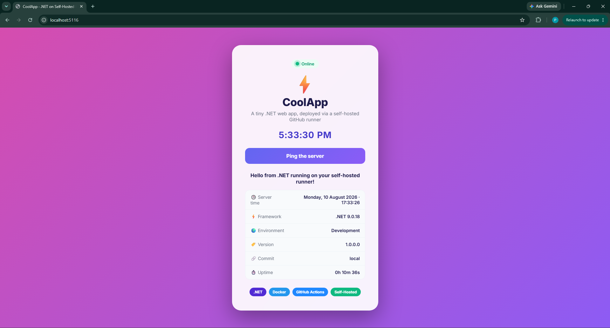
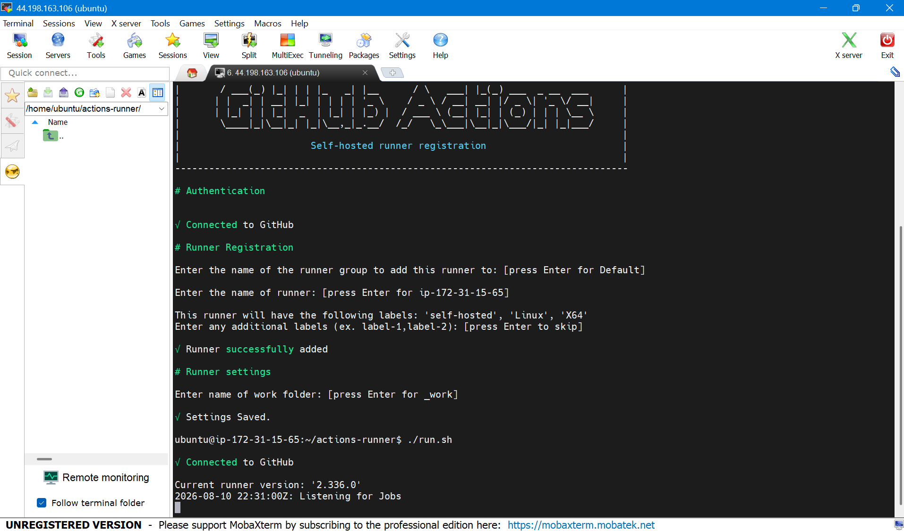
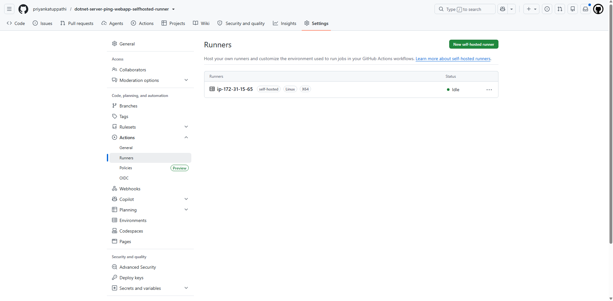
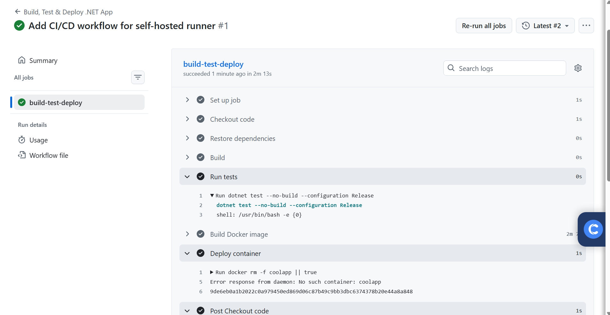
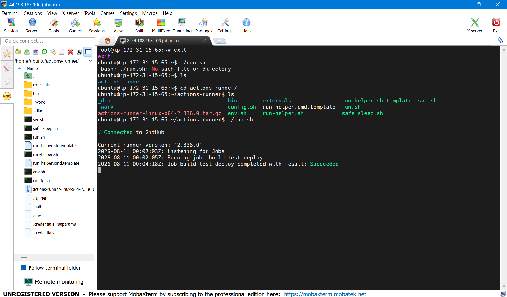
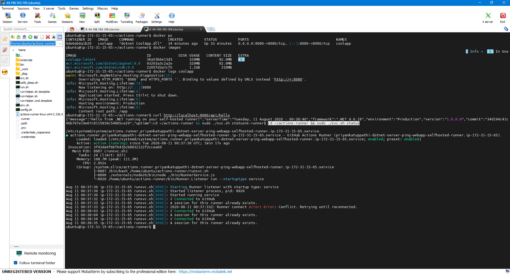

# dotnet-server-ping-webapp-selfhosted-runner

A small .NET web app wired up to a full CI/CD pipeline that runs on a **self-hosted GitHub Actions runner** hosted on **AWS EC2**. Every push to `main` builds, tests, containerizes, and deploys the app automatically — on infrastructure set up from scratch rather than GitHub's hosted runners.

`dotnet` · `github-actions` · `self-hosted-runner` · `ci-cd` · `docker` · `aws-ec2` · `devops`

---

## What this is

The focus here is the **pipeline and the infrastructure**, not the app. The app is deliberately tiny — a single page called **CoolApp** with a button that pings a `/api/hello` endpoint and shows details about where it's running: the framework, the environment, the git commit it was built from, and its uptime. It exists to prove the pipeline works end to end.

There's a small detail worth pointing out. Run the app on a laptop and it reports `Environment: Development` and `Commit: local`. Once it's gone through the pipeline and landed on the server, it reports `Environment: Production` and the real commit SHA that built it. So the running app itself confirms it was genuinely deployed through CI/CD, not just copied across.

---

## How it fits together

```
git push (main)
      │
      ▼
GitHub Actions workflow  ── runs on ──▶  self-hosted runner (AWS EC2)
      │
      ├── restore, build, test        →  is the code good?
      ├── docker build                →  package it into an image
      └── docker run -p 8080:8080     →  deploy the container
      │
      ▼
Live at http://<ec2-public-ip>:8080
```

**Stack:** ASP.NET Core (.NET 9) for the app, xUnit for tests, GitHub Actions for CI/CD, Docker for packaging, and an Ubuntu EC2 instance running the runner as a background service.

---

## What's in here

```
├── .github/workflows/ci-cd.yml   # the pipeline
├── CoolApp.sln
├── Dockerfile
├── CoolApp/                       # the web app
│   ├── Program.cs                 # minimal API + /api/hello
│   └── wwwroot/                   # the frontend (html/css/js)
└── CoolApp.Tests/                # xUnit tests
```

---

## The pipeline, step by step

Every push to `main` kicks off one job on the runner:

1. **Checkout** – pull the latest code onto the runner.
2. **Restore & Build** – compile in Release mode and catch anything broken early.
3. **Test** – run the xUnit tests.
4. **Build the Docker image** – package the app, stamping in the commit SHA so the deployed app knows exactly where it came from.
5. **Deploy** – swap the old container for the freshly built one, listening on port 8080.

The code gets built twice — once by `dotnet` and again inside Docker — and that's on purpose. The `dotnet build`/`test` run is the quick sanity check with readable test output; the Docker build produces a clean, self-contained image that runs the same anywhere. Check the code, then package it.

---

## Screenshots

**Running locally** — reporting Development and a "local" commit. This is the "before."



**The runner, connected and waiting for work** on the EC2 instance.



**GitHub's view of the same runner** — registered and idle, ready to pick up jobs.



**A green pipeline run** — build, test, Docker build, and deploy all passing, start to finish, on the runner.



**The runner actually doing the work** — picking up the job and finishing it successfully.



**Deployment, verified from the server** — the container running on port 8080, the image the pipeline built, the app's own logs, a live `curl` of the endpoint, and the runner running as a background service.



**The deployed app in a browser**, reached through the EC2 public IP — now showing Production and the real commit SHA. Put it next to the first screenshot to see the full journey.


---

## Running it yourself

**Locally:**

```bash
git clone https://github.com/priyankatuppathi/dotnet-server-ping-webapp-selfhosted-runner.git
cd dotnet-server-ping-webapp-selfhosted-runner
dotnet test
dotnet run --project CoolApp      # http://localhost:5000
```

**With Docker:**

```bash
docker build -t coolapp .
docker run -d -p 8080:8080 --name coolapp coolapp   # http://localhost:8080
```

**On a self-hosted runner (the whole point):**

1. Launch an Ubuntu EC2 instance and open port 8080 in its security group.
2. In the repo, go to **Settings → Actions → Runners → New self-hosted runner** and follow the commands it gives you.
3. Install .NET 9 and Docker on the box, and let the runner user use Docker (`sudo usermod -aG docker ubuntu`).
4. Install the runner as a service so it keeps running in the background:
   ```bash
   cd ~/actions-runner
   sudo ./svc.sh install ubuntu
   sudo ./svc.sh start
   ```
5. Push to `main` and watch it build and deploy on its own.

---

## A note on safety

Because this is a public repo, the pipeline triggers only on `push` to `main` (which only the owner can do) and never builds fork pull requests — so outside code never touches the runner. The EC2 instance should be shut down when it's not in use.
